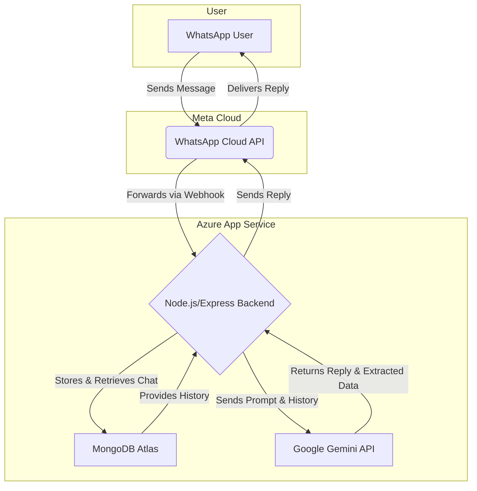

# WhatsApp Automation Backend


Node.js backend for WhatsApp automation using Express, Google Gemini, MongoDB, and GitHub Actions deployment to Azure App Service.

- Production entry: `fullOnBackend.js` (`npm start`)
- Optional test harness: `index.js` (`/test` endpoint)

## Table of Contents
- [Features](#features)
- [Architecture](#architecture)
- [Requirements](#requirements)
- [Environment Variables (.env)](#environment-variables-env)
- [Local Development](#local-development)
- [WhatsApp Cloud API Setup](#whatsapp-cloud-api-setup)
- [Endpoints](#endpoints)
- [Google Gemini](#google-gemini)
- [Data Models (MongoDB)](#data-models-mongodb)
- [Azure Deployment (GitHub Actions)](#azure-deployment-github-actions)
- [Security](#security)
- [Troubleshooting](#troubleshooting)
- [License](#license)
- [Notes](#notes)

## Features
- WhatsApp Cloud API webhook receiver (/webhook)
- Chat history persisted in MongoDB
- Contextual replies via Google Gemini (2.5-flash)
- Structured user info extraction and storage
- Azure Web App deployment via GitHub Actions

## Architecture
- Express server
- MongoDB collections:
  - Chat: phone, messages[{ role, text, timestamp }]
  - UserInfo: phone, data{ name, city, preferences[], healthIssues[], interestedProducts[], extractedAt }
- Flow:
  1) Receive message (POST /webhook)
  2) Store user message
  3) Generate Gemini reply with chat context
  4) Store model reply
  5) Send via WhatsApp Cloud API
  6) Extract structured user info and persist



## Requirements
- Node.js 20+
- MongoDB (Atlas or self-hosted)
- Google Gemini API key
- WhatsApp Cloud API access (Meta developer app + phone number)
- Azure App Service (for deployment via workflow)

## Environment Variables (.env)
- PORT: Server port (e.g., 3000)
- MONGO_URI: MongoDB connection string
- GEMINI_API_KEY: Google Generative Language API key
- VERSION: WhatsApp Graph API version (e.g., v20.0)
- PHONE_NUMBER_ID: WhatsApp business phone number ID
- WHATSAPP_TOKEN: WhatsApp Cloud API access token

Note: `.env` is gitignored. Configure these in Azure App Service as Application Settings for production.

## Local Development
1) **Install**
   ```bash
   npm install
   ```
2) **Configure `.env`**
   - See variables above
3) **Run**
   ```bash
   npm start
   ```
   - Server listens on `PORT` and exposes:
     - `GET /` (health/welcome)
     - `GET /webhook` (verification)
     - `POST /webhook` (message receiver)

### Webhook Testing with `ngrok`
To test the webhook with the actual WhatsApp Cloud API from your local machine, you need to expose your local server to the internet.
1. Install [ngrok](https://ngrok.com/download).
2. Run it to forward traffic to your local port.
   ```bash
   ngrok http 3000 # Or whatever port you are using
   ```
3. `ngrok` will provide a public `https://` URL. Use this as the "Callback URL" in your Meta developer app's webhook settings. The full URL will be `https://<your-ngrok-url>.ngrok.io/webhook`.

Optional (`index.js` test harness):
- POST /test
  - Body:
    {
      "wa": { "changes": [ ...the WhatsApp entry payload... ] },
      "prompt": "System/policy prompt prefix to steer replies"
    }
  - Used for local simulation without a WhatsApp webhook.

## WhatsApp Cloud API Setup
- In your Meta app:
  - Add Webhooks product and subscribe to `messages`
  - Callback URL: `https://YOUR_DOMAIN/webhook`
  - Verify Token: `HEHEHAHA` (matches `fullOnBackend.js`)
- Ensure:
  - The App is in Live mode (for real numbers)
  - Proper permissions and a permanent token or token refresh process
- Webhook Verification
  - `GET /webhook` implements the verify handshake with the static token

## Endpoints
- **`GET /`**
  - Simple welcome/health response
- **`GET /webhook`**
  - Verifies webhook (uses token `HEHEHAHA`)
- **`POST /webhook`**
  - Receives WhatsApp messages, stores chat, replies via Gemini, sends via WhatsApp, extracts user info.
  - **Example `curl` (simulated payload):**
    ```bash
    curl -X POST http://localhost:3000/webhook \
    -H "Content-Type: application/json" \
    -d '{
      "entry": [{
        "changes": [{
          "value": {
            "messages": [{
              "from": "1234567890",
              "text": { "body": "Hello there!" }
            }]
          }
        }]
      }]
    }'
    ```
- **`POST /test` (`index.js` only)**
  - Local testing endpoint that runs the same processing pipeline

## Google Gemini
- Models:
  - Replies: gemini-2.5-flash:generateContent
  - Extraction: gemini-2.0-flash:generateContent
- Ensure GEMINI_API_KEY is valid and has access to these models.
- Replies are limited to < 3000 characters by prompt.

## Data Models (MongoDB)
- Chat
  {
    phone: string,
    messages: [{ role: "user" | "model", text: string, timestamp: Date }]
  }
- UserInfo
  {
    phone: string,
    data: {
      name?: string,
      city?: string,
      preferences?: string[],
      healthIssues?: string[],
      interestedProducts?: string[],
      extractedAt: Date
    }
  }

## Azure Deployment (GitHub Actions)
This repo includes `.github/workflows/deploy.yml` to deploy to an Azure Web App upon pushing to `main`.

Prerequisites:
- Create an Azure Web App (Linux recommended) with Node 20
- Set Application Settings for all required environment variables in the Web App:
  - PORT
  - MONGO_URI
  - GEMINI_API_KEY
  - VERSION
  - PHONE_NUMBER_ID
  - WHATSAPP_TOKEN
- Generate `AZURE_CREDENTIALS` (service principal) and add to GitHub Secrets:
  - Secret name: `AZURE_CREDENTIALS`
  - Value: JSON from `az ad sp create-for-rbac` with the necessary scopes.
  - **Azure CLI command to create the principal:**
    ```bash
    az ad sp create-for-rbac --name "whatsapp-automation-sp" --role contributor \
                            --scopes /subscriptions/{subscription-id}/resourceGroups/{resource-group} \
                            --sdk-auth
    ```
    Replace `{subscription-id}` and `{resource-group}` with your actual values. Copy the entire JSON output.
- Ensure the `app-name` in `deploy.yml` matches your Web App name

Workflow summary:
- On push to main:
  - Checkout, setup Node 20, npm install
  - azure/login with AZURE_CREDENTIALS
  - Deploy with azure/webapps-deploy@v2 to the specified app/slot

Azure tips:
- Enable `Always On` (App Service > Configuration > General settings)
- Keep Node version aligned (App Service stack settings -> Node 20)
- Monitor logs: App Service Log Stream and Application Insights (optional)

## Security
- Do not commit .env or secrets
- Rotate WHATSAPP_TOKEN and GEMINI_API_KEY regularly
- Use least-privilege SP for `AZURE_CREDENTIALS`
- Validate incoming webhook sources if possible

## Troubleshooting
- **403 on `GET /webhook`**: Verify token mismatch; update callback verify token or server token (`HEHEHAHA`).
- **401/403 from WhatsApp Graph API**: Check `WHATSAPP_TOKEN`, app mode, permissions, phone number ID, and Graph API `VERSION`.
- **Gemini errors**: Check API key and model name; inspect response logs.
- **Gemini JSON parse error**: The `extractAndStoreUserInfo` function may fail if Gemini does not return valid JSON. The code attempts to gracefully handle this, but check logs for `JSON parse error` if user info is not being saved correctly.
- **Mongo errors**: Verify `MONGO_URI`, IP allowlist (for Atlas), and network access.
- **App not responding on Azure**: Ensure `PORT` is set; App Service must listen on `process.env.PORT`.

## License
ISC (see `package.json`)

## Notes
- Production uses `fullOnBackend.js` (defined in `package.json` "start").
- `index.js` provides a `/test` endpoint and an alternative handler for local experiments; not used by `npm start`.

## How to Make a Pull Request

1. **Fork** this repository to your own GitHub account.
2. **Clone** your fork:
   ```bash
   git clone https://github.com/YOUR_USERNAME/whatsapp-automation.git
   cd whatsapp-automation
   ```
3. **Create a new branch** for your changes:
   ```bash
   git checkout -b my-feature-branch
   ```
4. **Make your changes** and commit:
   ```bash
   git add .
   git commit -m "Describe your changes"
   ```
5. **Push** your branch to your fork:
   ```bash
   git push origin my-feature-branch
   ```
6. **Open a Pull Request** from your branch to the `main` branch of the original repository on GitHub.
7. Add a clear description of your changes and reference any related issues if applicable.

> Please ensure your code follows the project's style and passes any CI checks.
